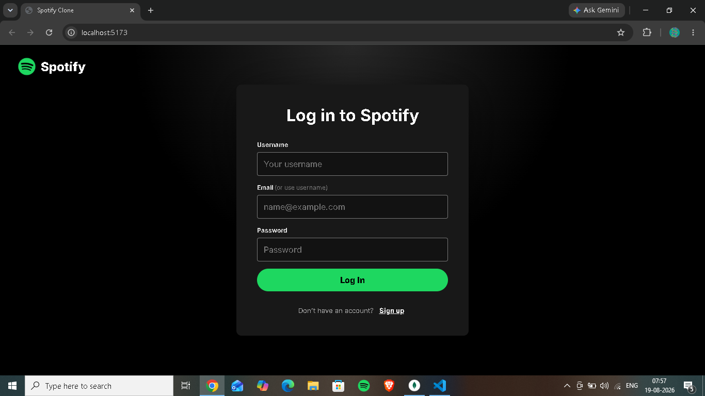
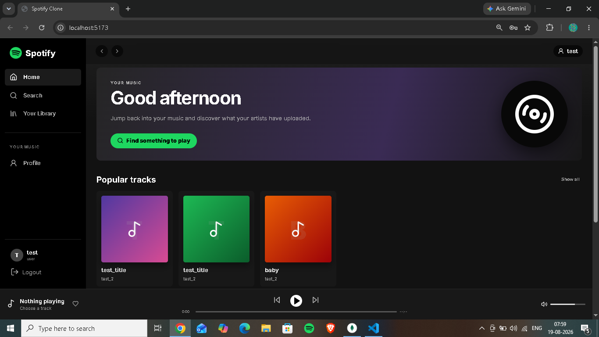
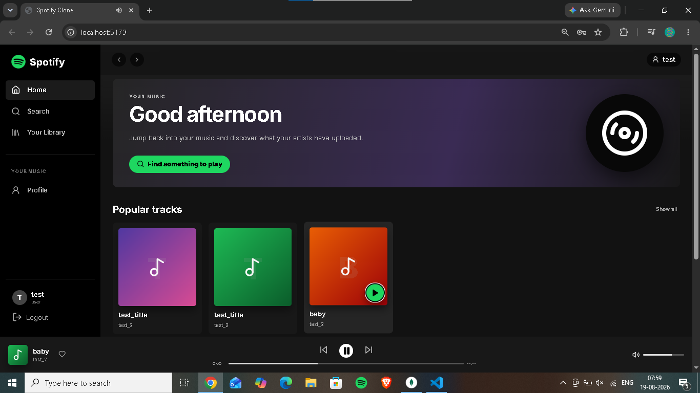
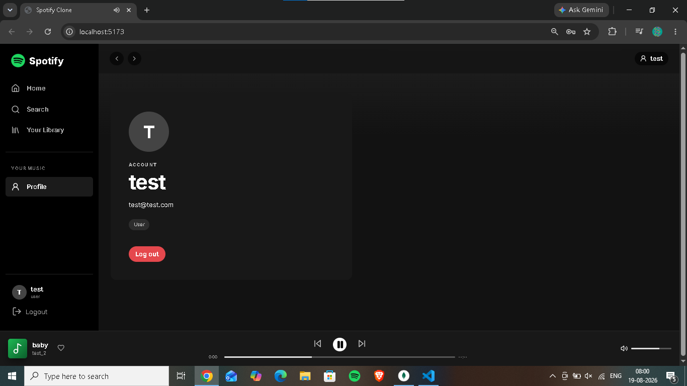

# 🎵 Spotify Clone — MERN Stack

A Spotify-inspired music streaming web application built with the **MERN stack**. The project combines a React/Vite frontend with a Node.js/Express backend, MongoDB for data storage, JWT authentication, and ImageKit for cloud audio storage.

## ✨ Features

- 🔐 User registration, login and logout
- 👤 User and Artist roles
- 🎵 Artist music upload
- 💿 Album creation
- 🔎 Music and album search
- ▶️ Play and pause music
- 📚 Your Library
- 👤 User profile
- 🎨 Spotify-inspired dark responsive UI
- 🍪 Cookie-based JWT authentication
- ☁️ ImageKit cloud storage for uploaded audio

## 🛠️ Tech Stack

### Frontend
- React.js
- Vite
- JavaScript
- CSS
- React Router
- Lucide React
- Fetch API

### Backend
- Node.js
- Express.js
- MongoDB
- Mongoose
- JWT
- Cookie-based authentication
- Multer
- ImageKit

## 📸 Project Screenshot









## 📁 Project Structure

```text
spotify/
├── spotify-backend/
│   ├── controllers/
│   ├── models/
│   ├── routes/
│   ├── services/
│   ├── middlewares/
│   └── ...
│
└── spotify-frontend/
    ├── public/
    │   └── spotify-logo.png
    ├── src/
    │   ├── App.jsx
    │   ├── api.js
    │   ├── index.css
    │   └── main.jsx
    ├── index.html
    ├── package.json
    └── vite.config.js
```

## 🔗 Frontend–Backend Connection

```text
React Frontend
      ↓
Vite Proxy (/api)
      ↓
Node.js + Express
      ↓
JWT / Cookies
      ↓
MongoDB
      ↓
ImageKit
```

The frontend uses a Vite proxy to forward `/api` requests to the backend running on port `3000`.

## 🔌 Main API Endpoints

### Authentication

```text
POST /api/auth/register
POST /api/auth/login
POST /api/auth/logout
```

### Music

```text
POST /api/music/upload
GET  /api/music/
```

### Albums

```text
POST /api/music/album
GET  /api/music/albums
GET  /api/music/albums/:albumId
```

## 🚀 Installation & Setup

### 1. Start the backend

```bash
cd spotify-backend
npm install
npm run dev
```

Make sure MongoDB and your backend environment variables are configured.

### 2. Start the frontend

Open another terminal:

```bash
cd spotify-frontend
npm install
npm run dev
```

Open:

```text
http://localhost:5173
```

## 🔐 Environment Variables

Never commit `.env` files or secret keys to GitHub.

Example:

```env
MONGO_URI=your_mongodb_connection
JWT_SECRET=your_jwt_secret
IMAGEKIT_PUBLIC_KEY=your_public_key
IMAGEKIT_PRIVATE_KEY=your_private_key
IMAGEKIT_URL_ENDPOINT=your_imagekit_endpoint
```

Use the exact variable names required by your backend.

## 🎯 Learning Outcomes

This project demonstrates practical experience with:

- MERN stack development
- REST API integration
- JWT authentication
- Role-based authorization
- MongoDB and Mongoose
- Multer file uploads
- ImageKit cloud storage
- React component development
- Responsive UI design
- Frontend/backend integration
- Git and GitHub

## ⚠️ Project Scope

This is a **Spotify-inspired educational project**, not an official Spotify application.

The current backend can be extended with persistent playlists, likes/favorites, recently played history, artist following, recommendations, richer song metadata, and advanced server-side search.

## 👨‍💻 Author

**Harsh Kumar**

Built as a full-stack MERN learning project.
